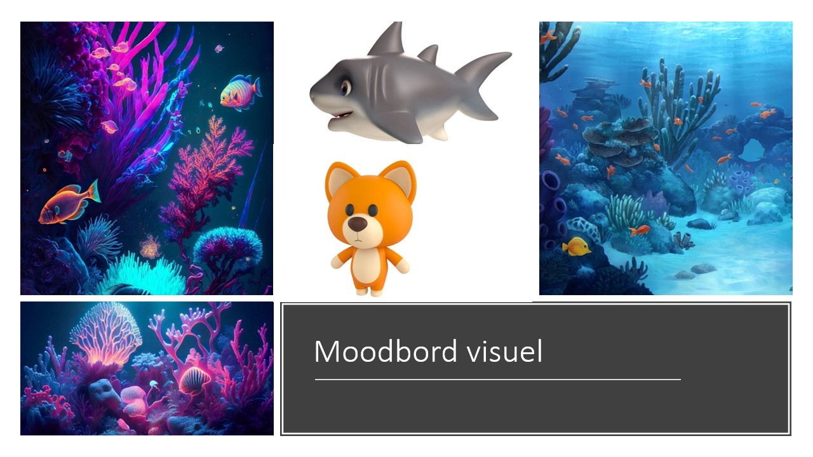
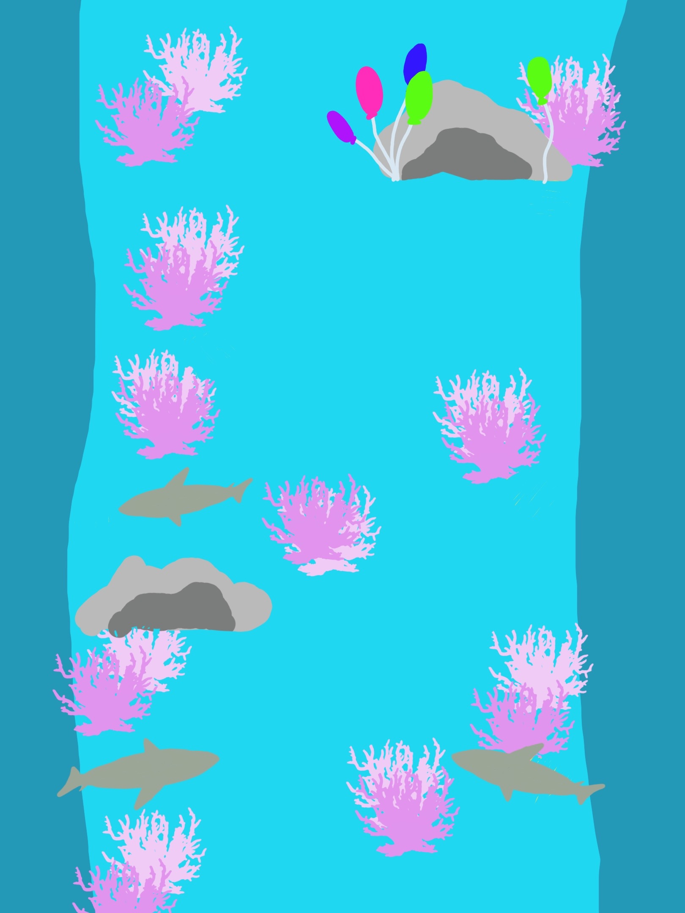
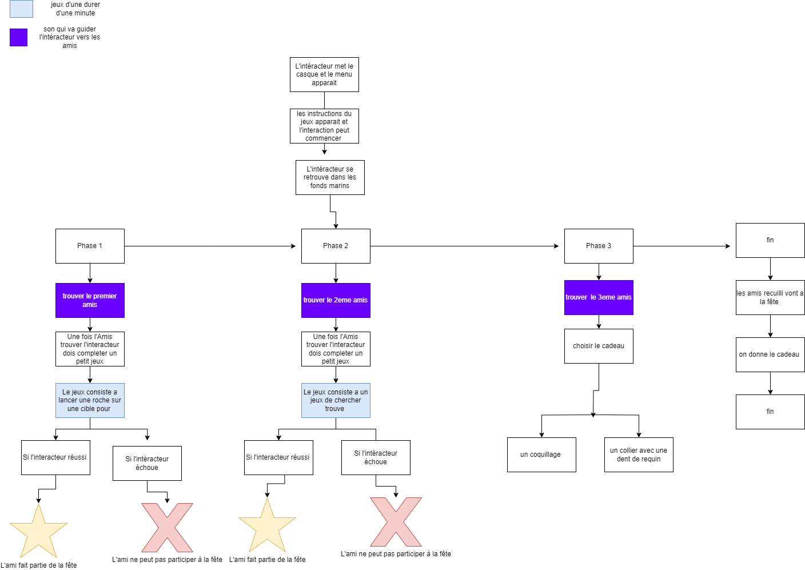

# Projet Vr

## Présentation projet
Histoire d'un requin qui part à la recherche d'ami pour la fête de son ami corgi.

## Description

le requin arrive dans l'ocean et la tout est noir, puis tout tout s'illumine le requin va pouvoir avancer. Il peut se promener des le fond de l'eau à la recherche d'amis pour aller à la fête. Le son va le guider s'il s'approche d'un amis, le son va le guider jusqu'à devenir de plus en plus fort un fois arriver dans la zone, un son va apparaitre il va y avoir un temps limiter pour jetée un coquillage sur une cyble , que l'intéracteur ai réussi ou non il peut passer à la prochaine étape, sauf qu'il va pas pouvoir récupérer son amis. Ensuite , l'intéracteur passe à la deuxième étape , qui consiste à trouver son deuxième ami. Le même principe que pour le premier ami va être utilisé,  mais à la place de lancer sur une cible sa va être un jeux de mémoire (trouver les pareils) qui une fois réussi ou pas va pouvoir libérer son ami requin. Par la suite, intéracteur va chercher son dernier ami, de la même manière que les autres au lieu d'un jeu , ça va être que l'intéracteur va pouvoir choisir le cadeau à offrir à son ami Corgie.
## moodbord visuel

## moodbord Sonore

 [Moodbord Sonore](https://cmontmorency365-my.sharepoint.com/:p:/g/personal/2133078_cmontmorency_qc_ca/EZ9mJpyzJQdNui28878j2PMBDySUkvZVkGmXLkNzaNf6WA?e=x1Y4mc)

## Synopsis
Jolyshark , une petit requine qui est attendu pour la fête de son amie Corgi , doit avant tout trouver ces amis qui sont invité à la fête,  mais une anguille nommer Ursula les a pièger et il va falloir les libérer avant que la fête commence.

## carte du projet 

## schémas de structure narative

